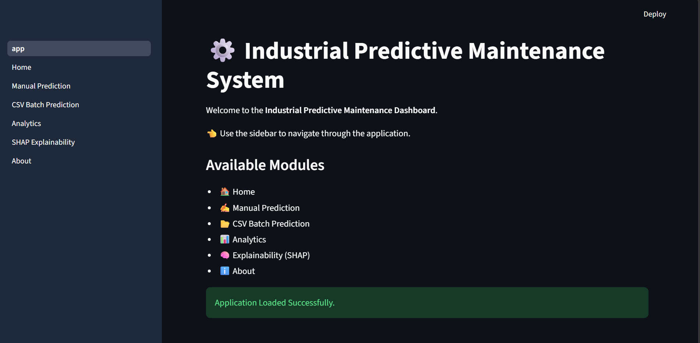
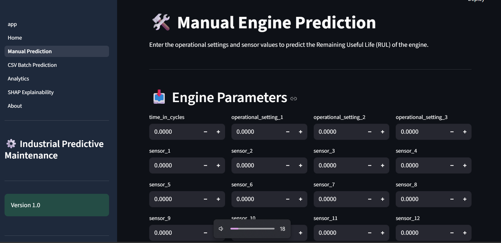
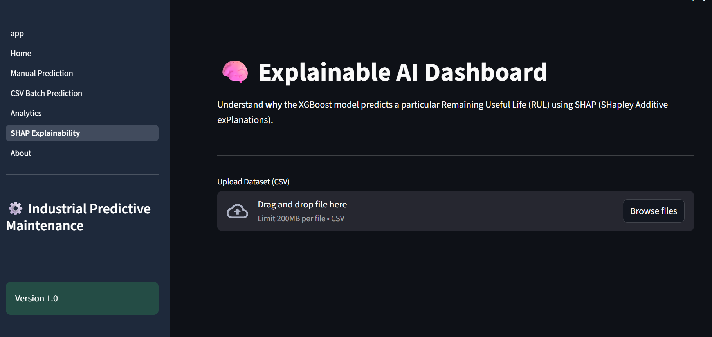
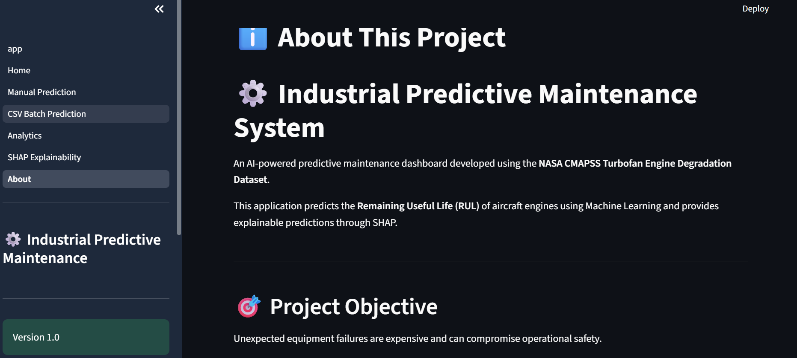

[](https://industrial-predictive-maintenance-system-mefkgejrl6f6uhvbdzpx5.streamlit.app/)
# 🛠️ Industrial Predictive Maintenance System using Explainable AI

<div align="center">


### 🧠 AI-Powered Remaining Useful Life (RUL) Prediction for Aircraft Turbofan Engines

*An Explainable Machine Learning dashboard that predicts the Remaining Useful Life (RUL) of aircraft engines using the NASA CMAPSS Turbofan Engine Degradation Dataset.*

</div>

---

# 🌌 Overview

Unexpected equipment failures are one of the biggest challenges in industrial systems.

Traditional maintenance strategies often lead to:

- ❌ Unexpected machine breakdowns
- ⚠️ High maintenance costs
- 🛠️ Unplanned downtime
- 📉 Reduced operational efficiency
- 💸 Expensive component replacement

This project presents an intelligent **Industrial Predictive Maintenance System** that leverages **Machine Learning** and **Explainable AI (XAI)** to estimate the **Remaining Useful Life (RUL)** of aircraft turbofan engines before failure occurs.

Using the **NASA CMAPSS FD001 dataset**, the system analyzes operational settings and sensor measurements to accurately predict engine degradation while providing transparent explanations through **SHAP (SHapley Additive exPlanations)**.

The platform combines:

- 🤖 Machine Learning
- 📊 Predictive Analytics
- 🧠 Explainable AI
- 📈 Interactive Dashboard Visualization
- ⚙️ Industrial Decision Support

into a professional Streamlit application.

---

# 🎯 Project Objectives

## 🔹 Primary Goals

✅ Predict Remaining Useful Life (RUL) of aircraft engines

✅ Analyze engine degradation using sensor measurements

✅ Provide Explainable AI insights using SHAP

✅ Support single-engine manual prediction

✅ Enable batch prediction through CSV uploads

✅ Visualize prediction trends using interactive dashboards

✅ Build an end-to-end industrial predictive maintenance solution

---

# 🚀 Features

---

# ✅ Core Features

- 🛠️ Manual Engine Prediction
- 📂 Batch Prediction using CSV Upload
- 📊 Interactive Analytics Dashboard
- 🧠 Explainable AI using SHAP
- 📈 Remaining Useful Life (RUL) Prediction
- ⚡ Fast XGBoost-based inference
- 🌙 Professional Multi-page Streamlit Dashboard

---

# 🔥 Advanced Features

## 🤖 Explainable AI (SHAP)

The application explains every prediction by identifying the contribution of individual sensor measurements toward the predicted Remaining Useful Life.

Features include:

- 📈 SHAP Summary Plot
- 📊 Global Feature Importance
- 🔍 Local Prediction Explanation
- 🧠 Model Transparency

---

## 📊 Batch Prediction

Supports bulk prediction through CSV datasets by allowing users to upload multiple engine records simultaneously.

Provides:

- Bulk inference
- Fast prediction
- Downloadable prediction results
- Efficient industrial workflow

---

## 📈 Interactive Analytics

Visual dashboards provide insights into:

- Prediction distribution
- Engine health trends
- Remaining Useful Life statistics
- Dataset exploration
- Performance visualization

---

## ⚙️ Professional Dashboard

Designed as a modern industrial monitoring application featuring:

- Multi-page architecture
- Responsive dark theme
- Sidebar navigation
- Interactive controls
- Enterprise-inspired UI

---

# 🧠 Technologies Used

<div align="center">

| Technology | Purpose |
|------------|---------|
| 🐍 Python | Core Programming |
| 🌐 Streamlit | Interactive Dashboard |
| 🤖 XGBoost | Machine Learning Model |
| 🧠 SHAP | Explainable AI |
| 📊 Plotly | Interactive Visualization |
| 📈 Matplotlib | Statistical Charts |
| 📚 Pandas | Data Processing |
| 🔢 NumPy | Numerical Computing |
| 🤖 Scikit-learn | Data Preprocessing & Evaluation |

</div>

---

# 🏗️ System Architecture

```text
                User
                  │
                  ▼
        Streamlit Web Dashboard
                  │
        ┌─────────┴─────────┐
        │                   │
        ▼                   ▼
 Manual Prediction      Batch Prediction
        │                   │
        └─────────┬─────────┘
                  ▼
        Data Preprocessing
                  │
                  ▼
         Feature Engineering
                  │
                  ▼
        XGBoost Regression Model
                  │
        ┌─────────┴─────────┐
        ▼                   ▼
 RUL Prediction       SHAP Explainability
        │                   │
        └─────────┬─────────┘
                  ▼
       Interactive Dashboard
```
# ⚙️ Working Flow

---

# 🪜 Step-by-Step Process

### 1️⃣ Data Collection

The system utilizes the **NASA CMAPSS FD001 Turbofan Engine Degradation Dataset**, which contains operational settings and sensor measurements collected from aircraft engines under varying operating conditions.

---

### 2️⃣ Data Preprocessing

The raw dataset undergoes preprocessing to improve data quality.

Tasks performed include:

- Handling missing values
- Removing unnecessary features
- Feature scaling
- Dataset normalization
- Preparing data for model training

---

### 3️⃣ Feature Engineering

Relevant operational settings and sensor measurements are selected to maximize prediction accuracy.

The system learns degradation patterns from:

- Operational Settings
- Sensor Measurements
- Engine Cycle Information

---

### 4️⃣ Model Training

An **XGBoost Regressor** is trained to estimate the Remaining Useful Life (RUL) of aircraft engines.

The trained model learns complex nonlinear relationships between engine degradation and sensor readings.

---

### 5️⃣ Remaining Useful Life Prediction

Users can perform predictions using:

- Manual Engine Input
- CSV Batch Upload

The trained model instantly predicts the estimated Remaining Useful Life.

---

### 6️⃣ Explainable AI (SHAP)

Every prediction can be interpreted using SHAP.

The dashboard highlights:

- Most influential features
- Positive feature contributions
- Negative feature contributions
- Feature importance rankings

---

### 7️⃣ Dashboard Visualization

Prediction results are displayed through an interactive Streamlit dashboard featuring:

- Analytics
- Charts
- Model insights
- Explainability

---

# 🧠 Machine Learning Pipeline

```text
NASA CMAPSS Dataset
        │
        ▼
Data Preprocessing
        │
        ▼
Feature Engineering
        │
        ▼
Train-Test Split
        │
        ▼
Feature Scaling
        │
        ▼
XGBoost Regression
        │
        ▼
Remaining Useful Life Prediction
        │
        ▼
SHAP Explainability
        │
        ▼
Interactive Streamlit Dashboard
```

---

# 🧬 Project Structure

```bash
Industrial-Predictive-Maintenance-System/
│
├── app/
│   ├── app.py
│   ├── styles.py
│   │
│   ├── assets/
│   │   └── hero.png
│   │
│   └── pages/
│       ├── 1_Home.py
│       ├── 2_Manual_Prediction.py
│       ├── 3_CSV_Batch_Prediction.py
│       ├── 4_Analytics.py
│       ├── 5_SHAP_Explainability.py
│       └── 6_About.py
│
├── data/
│
├── models/
│   ├── xgboost_model.pkl
│   ├── scaler.pkl
│   └── shap_explainer.pkl
│
├── notebooks/
│
├── reports/
│
├── screenshots/
│
├── requirements.txt
│
└── README.md
```

---

# ▶️ How to Run the Project

---

# 1️⃣ Clone the Repository

```bash
git clone https://github.com/YOUR_USERNAME/Industrial-Predictive-Maintenance-System.git
```

---

# 2️⃣ Navigate to the Project

```bash
cd Industrial-Predictive-Maintenance-System
```

---

# 3️⃣ Install Dependencies

```bash
pip install -r requirements.txt
```

---

# 4️⃣ Launch the Application

```bash
streamlit run app/app.py
```

---

# 🌐 Open in Browser

```text
http://localhost:8501
```

---

# 📷 Application Screenshots

## 🏠 Home Dashboard



---

## 🛠️ Manual Prediction



---

## 📂 CSV Batch Prediction


---

## 📊 Analytics Dashboard


---

## 🧠 Explainable AI Dashboard



---

## ℹ️ About Page



---
# 🤖 Machine Learning Model

The predictive engine is powered by **XGBoost Regressor**, a highly efficient gradient boosting algorithm known for its performance on structured datasets.

### Model Highlights

- 🚀 Fast inference
- 📈 High predictive accuracy
- 🔍 Captures nonlinear degradation patterns
- ⚙️ Robust against overfitting
- 🏭 Suitable for industrial predictive maintenance

The trained model estimates the **Remaining Useful Life (RUL)** of aircraft engines using operational settings and sensor measurements.

---

# 🧠 Explainable AI (XAI)

Unlike conventional black-box machine learning systems, this project integrates **SHAP (SHapley Additive exPlanations)** to improve model transparency.

The Explainability module provides:

- 📊 Global Feature Importance
- 📈 SHAP Summary Plot
- 🔍 Local Prediction Explanation
- ⚖️ Feature Contribution Analysis
- 🧩 Model Interpretation

This enables engineers and researchers to understand **why** a particular Remaining Useful Life prediction was generated.

---

# 📊 Model Evaluation

The trained model is evaluated using standard regression metrics.

### Performance Metrics

- 📉 Mean Absolute Error (MAE)
- 📉 Root Mean Squared Error (RMSE)
- 📈 R² Score

These metrics help assess the accuracy and reliability of Remaining Useful Life predictions.

---

# 📘 NASA CMAPSS Dataset

This project uses the **NASA Commercial Modular Aero-Propulsion System Simulation (CMAPSS)** dataset.

### Dataset Characteristics

- ✈️ Aircraft Turbofan Engines
- 🔧 Multiple Sensor Measurements
- ⚙️ Operational Settings
- 📊 Engine Degradation Simulation
- 🎯 Remaining Useful Life Labels

The FD001 subset was selected for this implementation due to its single operating condition and single fault mode, making it ideal for predictive maintenance research.

---

# 📈 System Capabilities

| Capability | Status |
|------------|--------|
| Manual Prediction | ✅ |
| CSV Batch Prediction | ✅ |
| Remaining Useful Life Prediction | ✅ |
| Interactive Dashboard | ✅ |
| SHAP Explainability | ✅ |
| Feature Importance Visualization | ✅ |
| Analytics Dashboard | ✅ |
| Multi-page Streamlit Application | ✅ |
| XGBoost Regression | ✅ |

---

# 🌍 Real-World Applications

This project can be extended for:

- ✈️ Aircraft Engine Health Monitoring
- 🏭 Smart Manufacturing
- ⚙️ Industrial Equipment Monitoring
- 🚄 Railway Maintenance Systems
- 🚗 Automotive Predictive Maintenance
- 🌬️ Wind Turbine Health Monitoring
- ⚡ Power Plant Asset Monitoring
- 🛢️ Oil & Gas Equipment Maintenance
- 🤖 Industry 4.0 Decision Support Systems

---

# 🔭 Future Enhancements

## Planned Extensions

- 🌐 Real-time IoT Sensor Integration
- ☁️ Cloud Deployment (AWS / Azure)
- 🐳 Docker Containerization
- ⚡ FastAPI Backend
- 📊 MLflow Experiment Tracking
- 🔄 Automatic Model Retraining
- 📱 Mobile-Friendly Dashboard
- 📈 Time-Series Forecasting
- 🚨 Predictive Maintenance Alert System

---

# 🎓 Intended Use

This project is ideal for:

- Machine Learning Students
- Data Science Enthusiasts
- Predictive Analytics Coursework
- Explainable AI Research
- Final-Year Engineering Projects
- Academic Demonstrations
- Industrial AI Research
- GitHub Portfolio Development

---

# 🌟 Why This Project Stands Out

Unlike traditional regression projects, this system combines:

- 🤖 Machine Learning
- 🧠 Explainable AI
- 📊 Interactive Analytics
- 🌐 Web Dashboard Deployment
- 📂 Batch Prediction
- 🏭 Industrial Decision Support

into a complete end-to-end predictive maintenance solution.

---

# 📄 License

This project is developed for:

- Academic Learning
- Educational Demonstrations
- Research & Experimentation
- Portfolio Development

Feel free to:

- 🍴 Fork
- 🛠️ Modify
- 🚀 Extend
- ⭐ Star the Repository

---

# 👨‍💻 Author

<div align="center">

## Made with ❤️ by **Adithyan P R**

🎓 Integrated M.Tech CSE (Data Science), VIT Vellore

📧 **Email:** adithyanprupasana@gmail.com

🔗 **LinkedIn**  
https://www.linkedin.com/in/adithyan-p-r-36b79a250

💻 **GitHub**  
https://github.com/ADITHYANPR

</div>

---

# 🙌 Acknowledgement

This project was developed by integrating concepts from:

- Machine Learning
- Predictive Analytics
- Explainable AI (SHAP)
- Industrial AI
- Data Visualization
- Aircraft Prognostics
- Remaining Useful Life (RUL) Prediction

Special thanks to **NASA** for providing the CMAPSS Turbofan Engine Degradation Dataset, enabling research and development in predictive maintenance.

---

<div align="center">

# 🚀 From Sensor Data → Intelligent Maintenance Decisions

### *Predict. Explain. Prevent.*

</div>

---

# ⭐ GitHub Support

If you found this project useful:

⭐ Star the repository

🍴 Fork the project

📢 Share it with others

💡 Feel free to contribute improvements and ideas!

<div align="center">

**Thank you for visiting this repository!**

</div>

---

